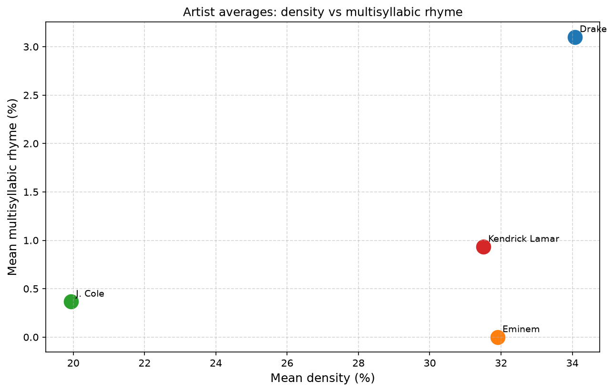
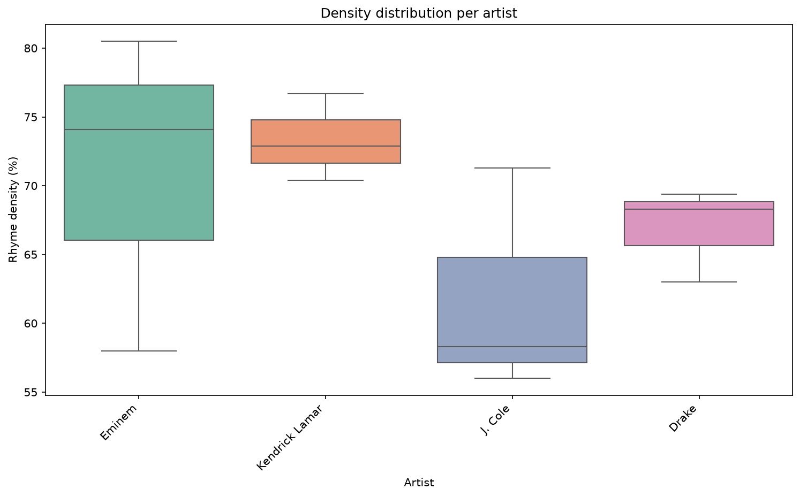
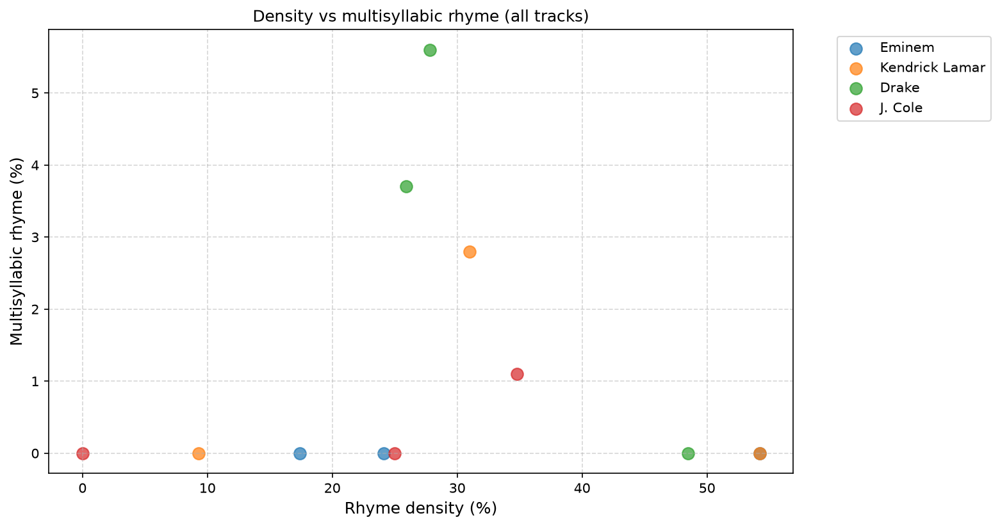
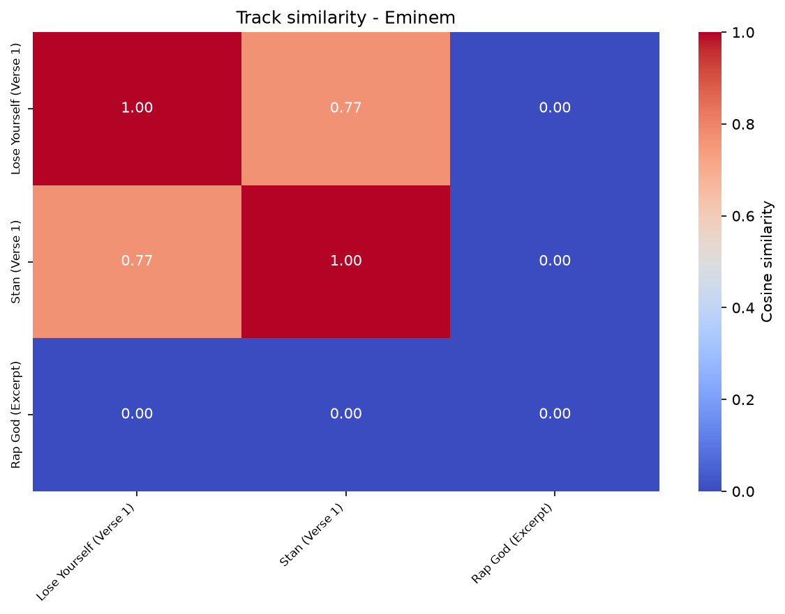

# RhymeMapper

**RhymeMapper** analyses rhyme schemes in rap lyrics from phonetic data. It converts
words to phonemes, splits them into syllables, and groups syllables that rhyme —
colour-coding them in the terminal and in a browser viewer, and computing metrics
that can be compared across tracks and artists.

## Install

```bash
make install        # dependencies + the NLTK corpora g2p_en needs
```

`g2p_en` depends on `distance`, which fails to build against setuptools 60+. If
`make install` trips on it:

```bash
pip install "setuptools<60" && pip install --no-build-isolation distance
pip install --upgrade setuptools && make install
```

## Use

```bash
make demo           # colour-code the demo verse in the terminal
make stats          # analyse a corpus -> data/stats.csv
make plots          # generate every figure into data/
make web            # export web/data.js and open the browser viewer
make serve          # viewer + live analysis of lyrics you paste in
make test           # run the unit tests
make eval           # gold set, ablation table, artist-ID experiment
```

Every entry point is a real CLI:

```bash
python -m src.main --file my_lyrics.txt --artist "Nas" --legend
python -m scripts.generate_stats --input dataset/my_corpus.csv --output data/mine.csv
python -m analysis.run_all_plots --show
```

Point any target at another corpus with `make stats DATASET=path/to.csv`. The CSV
needs `track_name`, `artist`, and one of `artist_verses` / `raw_lyrics` / `lyrics`.
A larger corpus to try:
<https://www.kaggle.com/datasets/ceebloop/rap-lyrics-for-nlp>

## How it works

```
lyrics -> clean_word -> syllabify (CMUdict) -> Syllable(onset, nucleus, coda)
       -> signature -> group by frequency -> labels A, B, ... Z, AA, AB, ...
       -> coloured output / metrics / figures
```

Phoneme and syllable lookups are cached in `.cache/`, so a repeated run of
`make stats` skips the phonetic work entirely (7.1s -> 0.34s on the bundled
corpus). Words outside CMUdict are recovered by spelling where possible —
g-dropping (`comin'` -> `coming`) and stripped apostrophes (`dont` -> `don't`) —
before falling back to the neural grapheme-to-phoneme model.

## Metrics

| Metric | Meaning |
|---|---|
| **Density** | % of syllables carrying a rhyme label |
| **Multi** | % of syllables inside a run of ≥2 consecutive syllables sharing one label |
| **Diversity** | distinct rhyme groups / total syllables |
| **Signatures** | number of distinct rhyme groups |
| **Syll.** | total syllable count |

## The viewer

`make web` opens a static page with the bundled verses pre-analysed. `make serve`
adds a local server so you can paste your own lyrics and switch engines live.

- Hover any syllable and every syllable in its rhyme group lights up across the
  whole verse; the tooltip shows the onset, nucleus and coda behind the match.
- The sidebar lists rhyme groups longest-first. Click one to isolate it and dim
  everything else — this is what makes a multisyllabic chain such as
  `straight face lookin' boy` / `take place lookin' boy` / `they say lookin' boy`
  visible as a single structure.
- Switching the engine re-analyses the verse on screen, so the v1 baseline and
  the current engine can be compared on the same lyrics.

Analysis runs on a small local server rather than in JavaScript, because CMUdict
is several megabytes and a second implementation of the phonetic engine would
drift from the Python one — and then the browser and the terminal would disagree
about what rhymes. The static page still works with no server; only the paste box
and engine switching need it.

## Does it work?

`make eval` rebuilds the gold set, runs the full ablation, and regenerates
[`eval/RESULTS.md`](./eval/RESULTS.md) and [`eval/ARTIST_ID.md`](./eval/ARTIST_ID.md).

Scored against 13 hand-annotated verses (123 lines, 4 artists), grouping lines by
their final rhyme:

| Configuration | Pairwise F1 | B³ F1 |
|---|---|---|
| all lines separate (trivial) | 0.000 | 0.657 |
| all lines together (trivial) | 0.287 | 0.536 |
| `exact` — v1 baseline | 0.648 | 0.861 |
| `+consonant classes` | 0.654 | 0.849 |
| `+vowel space` | 0.727 | 0.899 |
| **`similarity` — full feature scoring** | **0.865** | **0.942** |
| `similarity` without the onset penalty | 0.832 | 0.934 |
| `chains` — multisyllabic spans | 0.454 | 0.786 |

Three things worth stating plainly:

- The similarity engine is a real improvement on the v1 baseline: **0.648 → 0.865**.
- **The chain engine scores worse than the baseline on this test.** It has the
  highest precision of any configuration and the lowest recall — it groups
  correctly but sparsely, because it looks for repeated contiguous spans while
  this gold set annotates line-final rhyme. It is the right tool for seeing a
  verse's structure and the wrong one for partitioning line endings, so
  `similarity` is the default.
- **Metrics alone do not identify the artist.** Every classifier tried lands at
  or below the 25% chance level, and no single metric separates the artists
  (ANOVA p = 0.29–0.96). With 3 verses per artist that is *no evidence*, not
  evidence of no effect — but it does mean the artist-similarity and dendrogram
  figures show clustering this corpus cannot support.

The annotations were made by Claude following a documented protocol, not by a
human expert. They are a consistent reference for comparing engines, not ground
truth; independent re-annotation is the most valuable next step.

## Rhyme matching

By default a syllable's signature is its vowel, its stress, and its exact coda,
so two syllables rhyme only if all three match. Passing
`use_consonant_families=True` replaces each coda consonant with its natural class
(NAS, PLO, SIB, FRI, LIQ, GLI, ASP), which makes slant rhymes such as
`loud` / `out` (both `AW` + plosive) group together.

## Figures






## Requirements

Python 3.10+, plus the packages in `requirements.txt`.

## Layout

```
src/        core: models, phonetics, engine, metrics, visual, main
scripts/    CLI entry points (stats generation, NLTK bootstrap)
analysis/   figure generation
tests/      unit tests
dataset/    input corpora and the demo verse
data/       generated stats.csv and figures
web/        browser viewer
```

Developer notes: [DOC_DEV.md](./DOC_DEV.md) · Version history: [HISTORY.md](./HISTORY.md)
